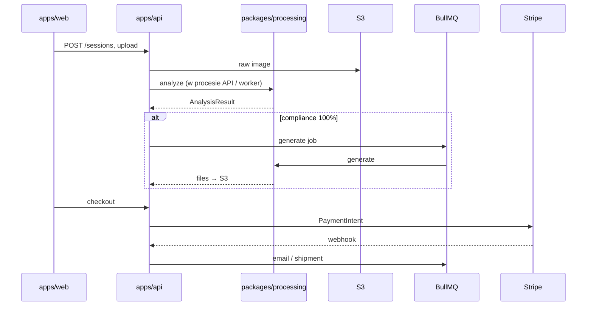

# Dokumenty ID Web — architektura MVP

## Model biznesowy

**Samodzielna aplikacja webowa — sprzedaż wyłącznie online.** Brak integracji ze starym programem desktop ani z zewnętrznymi silnikami. Szczegóły: [PRODUCT_MODEL.md](./PRODUCT_MODEL.md), [STANDALONE.md](./STANDALONE.md).

## Kontekst techniczny

Analiza zdjęć, generacja elektroniczna i impozycja 1×8 na 10×15 są implementowane **w tym repozytorium** (`packages/processing`), wywoływane z `apps/api`.

## Stack technologiczny MVP

| Warstwa | Technologia | Uzasadnienie |
|--------|-------------|--------------|
| **Frontend (sklep www)** | Next.js 15 (App Router), React 19 | Landing, capture w przeglądarce, koszyk |
| **Panel admin** | Next.js 15 (`apps/admin`) | Izolacja, RBAC |
| **Backend** | Node.js 20 + **Fastify** + REST `/api/v1` | Upload, sesje, płatności |
| **Przetwarzanie** | **`packages/processing`** (TypeScript) | Analiza + generacja — część tej samej aplikacji |
| **ORM / DB** | PostgreSQL 16 + Prisma | Zamówienia, sesje, audit |
| **Storage** | S3-compatible (MinIO / R2 / S3 EU) | Obrazy poza DB |
| **Kolejka** | BullMQ + Redis | Długie joby analyze/generate w API |
| **E-mail** | Resend / SES | Dostawa cyfrowa |
| **Płatności** | Stripe (PLN) | Wyłącznie online |
| **Auth — klient** | Sesja wizyty (cookie/token) | Bez kont; e-mail przy checkout |
| **Auth — admin** | JWT + RBAC | Panel operacyjny |
| **Monitoring** | Pino + Sentry + OTEL | Logi bez danych biometrycznych |

### Bezpieczeństwo danych biometrycznych

- Pliki w S3; dostęp przez signed URLs; watermark na miniaturach.
- Retencja i audit log; hosting UE; zero sekretów w repo.

## Struktura monorepo

```
dokumenty-id-web/
├── apps/
│   ├── web/              # Sklep www
│   ├── api/              # REST + workers + ProcessingService
│   └── admin/            # Panel admin
├── packages/
│   ├── shared/           # Kontrakty sklepu
│   └── processing/       # Analiza + generacja (własna logika)
└── docs/
```

## Przepływ danych



## Granice modułów

| Moduł | Odpowiedzialność |
|-------|------------------|
| `apps/web` | UX sklepu, capture, koszyk |
| `apps/api` | HTTP, DB, S3, kolejki, Stripe, orchestracja `processing` |
| `packages/processing` | Reguły biometryczne, scoring, generacja JPEG |
| `apps/admin` | Zamówienia, KPI, RBAC |
| `packages/shared` | Typy współdzielone |
