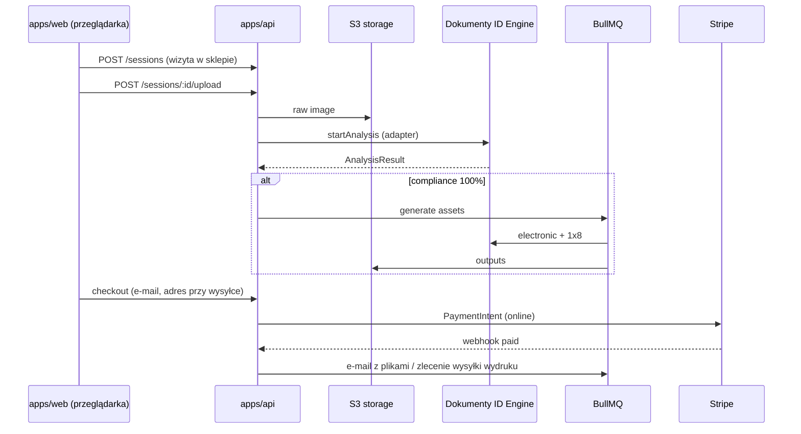

# Dokumenty ID Web — architektura MVP

## Model biznesowy

**Aplikacja typowo webowa — sprzedaż wyłącznie online.** Klient korzysta ze strony w przeglądarce (telefon lub komputer), płaci przez internet (Stripe), otrzymuje pliki e-mailem lub — przy wyższym pakiecie — wydruk **wysyłany na adres**. Brak kiosku, stanowiska w salonie i odbioru osobistego.

Szczegóły produktów: [PRODUCT_MODEL.md](./PRODUCT_MODEL.md)

## Kontekst techniczny

Program **Dokumenty ID** (desktop) jest **przebudowywany** na usługę `apps/engine` (HTTP). Sklep (`apps/api` + `apps/web`) łączy się przez adapter w `apps/api/src/adapters/dokumenty-id/`. Logika biometryczna migruje do `apps/engine/src/core/` — nie do frontendu. Plan: [ENGINE_REBUILD.md](./ENGINE_REBUILD.md).

## Stack technologiczny MVP

| Warstwa | Technologia | Uzasadnienie |
|--------|-------------|--------------|
| **Frontend (sklep www)** | Next.js 15 (App Router), React 19, CSS modules / vanilla CSS | Landing SEO, capture w przeglądarce, routing `/m/[token]` tylko przy opcjonalnym QR desktop→telefon |
| **Panel admin** | Next.js 15 (osobna app `apps/admin`) | Izolacja powierzchni ataku, osobne domeny/cookies, współdzielone typy z `packages/shared` |
| **Backend** | Node.js 20 + **Fastify** + REST `/api/v1` | Lekki, szybki, dobra obsługa multipart (upload), niski narzut vs Nest — wystarczający na MVP |
| **ORM / DB** | **PostgreSQL 16** + **Prisma** | Relacje Order/Payment/Audit, migracje, typy TS; standard produkcyjny |
| **Storage** | **S3-compatible** (MinIO lokalnie, R2/S3 w prod, region **EU**) | Obrazy biometryczne poza DB; signed URLs; lifecycle/retencja |
| **Kolejka** | **BullMQ** + **Redis** | Analiza, generacja, e-mail — asynchronicznie, retry, idempotencja (etap 3–4) |
| **E-mail** | **Resend** (lub AWS SES) | Transakcyjne maile, webhook delivery status; prosta integracja |
| **Płatności** | **Stripe** (PLN, BLIK/karty) | Webhooks, idempotency keys, dojrzały ekosystem |
| **Auth — klient** | Sesja e-commerce (cookie/token wizyty, opcjonalny QR) | Bez kont użytkownika; krótki TTL; identyfikacja po e-mail przy checkout |
| **Auth — admin** | JWT + refresh + **RBAC** w DB (etap 5) | Role: viewer, operator, superadmin; audit kto/co/kiedy |
| **Monitoring** | **Pino** (structured logs) + **Sentry** + **OpenTelemetry** → Grafana/Datadog | Błędy, latency API/kolejek; **redakcja** danych biometrycznych w logach |
| **IaC / deploy** | Docker Compose (dev), **Terraform** lub Pulumi (prod) | Powtarzalne środowiska; staging → prod |

### Bezpieczeństwo danych biometrycznych

- Pliki tylko w S3; dostęp przez **signed URLs** z krótkim TTL + watermark na miniaturach.
- **Retencja**: job cron usuwa surowe pliki po X dniach po dostarczeniu (konfigurowalne).
- **Audit log**: każda zmiana statusu, dostęp admina do pliku, webhook płatności.
- **RODO**: hosting UE, DPA z dostawcami, polityka usuwania na żądanie (etap 7).
- **Zero sekretów w repo** — `.env` lokalnie, secrets manager w chmurze.

## Struktura monorepo

```
dokumenty-id-web/
├── apps/
│   ├── web/          # Sklep www: landing, capture, koszyk, płatność
│   ├── api/          # REST sklepu, adapter → engine, workers
│   ├── engine/       # Silnik: analiza + generacja (port z desktopu)
│   └── admin/        # Panel administracyjny
├── packages/
│   ├── shared/       # Kontrakty sklepu
│   └── engine-contract/  # Kontrakty HTTP silnika
├── docs/
│   ├── ARCHITECTURE.md
│   └── DEPLOYMENT_PLAN.md
├── docker-compose.yml
└── turbo.json + pnpm workspaces
```

## Przepływ danych (docelowy)



## Granice modułów

| Moduł | Odpowiedzialność |
|-------|------------------|
| `apps/web` | Sklep online: capture, maska, analiza, podgląd, koszyk, płatność |
| `apps/api` | Sesje, upload, adapter, kolejki, płatności, e-mail |
| `apps/admin` | Zamówienia, pliki (ograniczony dostęp), KPI, RBAC |
| `packages/shared` | Kontrakty API, enums, mapy błędów PL |
| Adapter `dokumenty-id` | Tłumaczenie API silnika → `AnalysisResult` |
